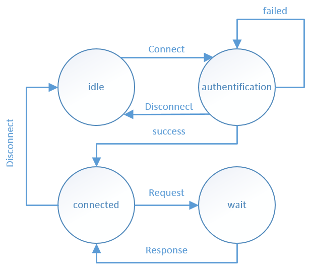

# Really Smart Calculator Protocol V1.0 Spécification

    Author              : Yann Malherbe, Cédric Rudareanu
    Last revision date  : 21.03.2014

    Revision history
             27.03.2014 : First version

**Table of Contents** 

- [Introduction](#introduction)
- [Terminologie](#terminologie)
	- [Connexion](#connexion)
	- [Messages](#messages)
		- [Requêtes](#requêtes)
		- [Réponses](#réponses)
- [Protocole Overview](#protocole-overview)
	- [Architecture du système](#architecture-du-système)
	- [Composants du système](#composants-du-système)
		- [Client](#client)
		- [Serveur](#serveur)
	- [Interactions entre composants](#interactions-entre-composants)
- [Détails du protocole](#détails-du-protocole)
	- [Protocoles de transport et de connexions](#protocoles-de-transport-et-de-connexions)
	- [Gestion d'états](#gestion-détats)
		- [Idle](#idle)
		- [Authentification](#authentification)
		- [Connected](#connected)
		- [Wait](#wait)
	- [Type de message, syntaxe et sémantique](#type-de-message-syntaxe-et-sémantique)
		- [Demande de connexion [C->S]](#demande-de-connexion-c->s)
		- [Réponse de connnexion [S->C]](#réponse-de-connnexion-s->c)
		- [Demande d'authentification [C->S]](#demande-dauthentification-c->s)
		- [Création de compte [C->S]](#création-de-compte-c->s)
		- [Validation de compte [S->C]](#validation-de-compte-s->c)
		- [Réponse d'authentification [S->C]](#réponse-dauthentification-s->c)
		- [Déconnexion [C->S]](#déconnexion-c->s)
		- [Demande d'opération [C->S]](#demande-dopération-c->s)
		- [Réponse du server [S->C]](#réponse-du-server-s->c)
	- [Diverses considérations](#diverses-considérations)
	- [Sécurité](#sécurité)
- [Exemples](#exemples)
	- [Connexion au serveur ouvert, liste les fonctions et en exécute une](#connexion-au-serveur-ouvert-liste-les-fonctions-et-en-exécute-une)
	- [Connexion à un serveur privé et création d'un compte](#connexion-à-un-serveur-privé-et-création-dun-compte)

# Introduction
Le protocole RSCP (Really Smart Calculator Protocol) permet une
communication simple entre un client et un serveur.

Son but est d'être utilisé entre une smart calculatrice et un serveur.

Il est basé sur des commandes de type texte en UTF-8.

# Terminologie
Cette spécification utilise un certain nombre de termes pour se référer
aux rôles des différents participants à la communication RSCP.

## Connexion
Il y a une couche de transport virtuelle qui permet d'établir la
communication entre le client et le serveur.

## Messages
La base de la communication RSCP consiste en un échange de messages
structuré via la connection dont la syntaxe est définie dans la section
"Type de message, syntaxe et sémantique".

### Requêtes
Un message de requête RSCP (tel que définit dans la section "Type de
message, syntaxe et sémantique").

### Réponses
Un message de réponse RSCP (tel que définit dans la section "Type de
message, syntaxe et sémantique").

# Protocole Overview
La connection RSCP est initiée par le client en envoyant un message de
requête au serveur. Ce dernier répond soit par une authentification ok
dans le cas d'un serveur public. Soit par une demande d'authentification
qui amenera le client à se connecter ou créer un compte.

Une fois l'authentification établie, des messages standard de type
requête/réponse transitent entre le Smart Calculator et le serveur comme
ci-dessous.

Client----[Requête]---->Server

Client<---[Reponse]-----Server

## Architecture du système
Ci-dessous l'architecture du système de communication entre le client et
le serveur.

|---------|&nbsp;&nbsp;&nbsp;&nbsp;&nbsp;&nbsp;&nbsp;&nbsp;&nbsp;&nbsp;&nbsp;&nbsp;&nbsp;&nbsp;&nbsp;&nbsp;&nbsp;&nbsp;&nbsp;&nbsp;|----------| 
| Client |<------------->| Server | 
|---------| &nbsp;&nbsp;&nbsp;&nbsp;&nbsp;&nbsp;&nbsp;&nbsp;&nbsp;&nbsp;&nbsp;&nbsp;&nbsp;&nbsp;&nbsp;&nbsp;&nbsp;&nbsp;&nbsp;|----------|

## Composants du système
Il y a deux composants dans ce système, le client et le serveur.

### Client
Le client est une machine qui a le système "Smart Calculator" et qui
communique avec un serveur. Le système a pour but de proposer diverses
opérations mathématique ou autres possibilités. Lors de la sélection d'une
de ces dernières alors la machine va envoyer les informations à un
serveur distant afin que les calculs soit effectué sur celui-ci. Une
fois le calcul effectuer le serveur retourne le résultat et ainsi le
système client peut afficher le résultat de l'opération souhaitée.

### Serveur
Le serveur a pour but d'être présent pour établir des connexions avec
des "Smart Calculator" et permet d'effectuer les opérations souhaitées
par les systèmes client. Il peut soit être en mode ouvert ou soit en
mode authentification. Cette dernière agit de la même façon sauf qu'elle
requiert avant tout que le client s'authentifie auprès du serveur.

## Interactions entre composants
Ci dessous les différentes interactions entre le client et le serveur.

Client&nbsp;&nbsp;&nbsp;&nbsp;&nbsp;&nbsp;&nbsp;&nbsp;&nbsp;&nbsp;&nbsp;&nbsp;&nbsp;&nbsp;&nbsp;&nbsp;&nbsp;&nbsp;&nbsp;&nbsp;&nbsp;&nbsp;&nbsp;&nbsp;&nbsp;&nbsp;&nbsp;&nbsp;&nbsp;&nbsp;&nbsp;&nbsp;&nbsp;&nbsp; Server

 &nbsp;&nbsp;&nbsp;&nbsp;| 1 Connection demand &nbsp;&nbsp;&nbsp;&nbsp;&nbsp;&nbsp;&nbsp;&nbsp;| 
  &nbsp;&nbsp;&nbsp;&nbsp;|---------------------------------->| 
  &nbsp;&nbsp;&nbsp;&nbsp;|  &nbsp;&nbsp;&nbsp;&nbsp; &nbsp;&nbsp;&nbsp;&nbsp; &nbsp;&nbsp;&nbsp;&nbsp; &nbsp;&nbsp;&nbsp;&nbsp; &nbsp;&nbsp;&nbsp;&nbsp; &nbsp;&nbsp;&nbsp;&nbsp; &nbsp;&nbsp;&nbsp;&nbsp; &nbsp;&nbsp;&nbsp;&nbsp;&nbsp;&nbsp;&nbsp;&nbsp;&nbsp;| 
  &nbsp;&nbsp;&nbsp;&nbsp;| 2 Authentification request &nbsp;&nbsp;| 
  &nbsp;&nbsp;&nbsp;&nbsp;|<----------------------------------| 
  &nbsp;&nbsp;&nbsp;&nbsp;|&nbsp;&nbsp;&nbsp;&nbsp; &nbsp;&nbsp;&nbsp;&nbsp; &nbsp;&nbsp;&nbsp;&nbsp; &nbsp;&nbsp;&nbsp;&nbsp; &nbsp;&nbsp;&nbsp;&nbsp; &nbsp;&nbsp;&nbsp;&nbsp; &nbsp;&nbsp;&nbsp;&nbsp; &nbsp;&nbsp;&nbsp;&nbsp;&nbsp;&nbsp;&nbsp;&nbsp; | 
  &nbsp;&nbsp;&nbsp;&nbsp;| 3 Authentification response | 
  &nbsp;&nbsp;&nbsp;&nbsp;|---------------------------------->| 
  &nbsp;&nbsp;&nbsp;&nbsp;|&nbsp;&nbsp;&nbsp;&nbsp; &nbsp;&nbsp;&nbsp;&nbsp; &nbsp;&nbsp;&nbsp;&nbsp; &nbsp;&nbsp;&nbsp;&nbsp; &nbsp;&nbsp;&nbsp;&nbsp; &nbsp;&nbsp;&nbsp;&nbsp; &nbsp;&nbsp;&nbsp;&nbsp; &nbsp;&nbsp;&nbsp;&nbsp;&nbsp;&nbsp;&nbsp;&nbsp;&nbsp;| 
  &nbsp;&nbsp;&nbsp;&nbsp;| 4 Connection status &nbsp;&nbsp;&nbsp;&nbsp;&nbsp;&nbsp;&nbsp;&nbsp;&nbsp;&nbsp;| 
  &nbsp;&nbsp;&nbsp;&nbsp;|<---------------------------------| 
  &nbsp;&nbsp;&nbsp;&nbsp;| &nbsp;&nbsp;&nbsp;&nbsp; &nbsp;&nbsp;&nbsp;&nbsp; &nbsp;&nbsp;&nbsp;&nbsp; &nbsp;&nbsp;&nbsp;&nbsp; &nbsp;&nbsp;&nbsp;&nbsp; &nbsp;&nbsp;&nbsp;&nbsp; &nbsp;&nbsp;&nbsp;&nbsp; &nbsp;&nbsp;&nbsp;&nbsp;&nbsp;&nbsp;&nbsp;| 
  &nbsp;&nbsp;&nbsp;&nbsp;| 5 Operation request &nbsp;&nbsp;&nbsp;&nbsp;&nbsp;&nbsp;&nbsp;&nbsp;&nbsp;| 
  &nbsp;&nbsp;&nbsp;&nbsp;|--------------------------------->| 
  &nbsp;&nbsp;&nbsp;&nbsp;|&nbsp;&nbsp;&nbsp;&nbsp; &nbsp;&nbsp;&nbsp;&nbsp; &nbsp;&nbsp;&nbsp;&nbsp; &nbsp;&nbsp;&nbsp;&nbsp; &nbsp;&nbsp;&nbsp;&nbsp; &nbsp;&nbsp;&nbsp;&nbsp; &nbsp;&nbsp;&nbsp;&nbsp; &nbsp;&nbsp; &nbsp;&nbsp;&nbsp;&nbsp;&nbsp;| 
  &nbsp;&nbsp;&nbsp;&nbsp;| 6 Operation response &nbsp;&nbsp;&nbsp;&nbsp;&nbsp;&nbsp;&nbsp;| 
  &nbsp;&nbsp;&nbsp;&nbsp;|<---------------------------------| 
  &nbsp;&nbsp;&nbsp;&nbsp;| &nbsp;&nbsp;&nbsp;&nbsp; &nbsp;&nbsp;&nbsp;&nbsp; &nbsp;&nbsp;&nbsp;&nbsp; &nbsp;&nbsp;&nbsp;&nbsp; &nbsp;&nbsp;&nbsp;&nbsp; &nbsp;&nbsp;&nbsp;&nbsp; &nbsp;&nbsp;&nbsp;&nbsp; &nbsp;&nbsp;&nbsp;&nbsp;&nbsp;&nbsp;&nbsp;| 
  &nbsp;&nbsp;&nbsp;&nbsp;| 7 Disconnect &nbsp;&nbsp;&nbsp;&nbsp;&nbsp;&nbsp;&nbsp;&nbsp;&nbsp;&nbsp;&nbsp;&nbsp;&nbsp;&nbsp;&nbsp;&nbsp;&nbsp;&nbsp;&nbsp;&nbsp;&nbsp;| 
  &nbsp;&nbsp;&nbsp;&nbsp;|--------------------------------->|

Le message 1 est la demande de connexion du client vers le serveur.

Les messages 2 et 3 n'a lieu que dans la mode authentification du
serveur. Ce sont donc les messages d'authenfications.

Le message 4 indique si la connexion est établie ou non. Dans ce dernier
cas le client peut reprendre au point 3.

Si la connexion est établie, le client peut alors envoyer des requêtes
d'opération et le serveur des réponses. (5 et 6).

Une fois les échanges terminés, le client peut envoyer un message de
déconnexion au serveur afin de finir l'interaction (message 7).

# Détails du protocole
## Protocoles de transport et de connexions
La communication RSCP s'effectue à travers une connection TCP sur le
port 6556.

La partie serveur créé une socket serveur TCP qui écoute ce port afin
d'être en attente d'une connexion. La partie client va créer une socket
TCP et tenter de se connecter au serveur par celle-ci.

Une fois les sockets connectées, elles sont conservées durant toute la
durée des échanges jusqu'à un message de déconnexion venant du client ou
au bout de 30 minutes d'inactivité de la part des composants.

## Gestion d'états
Ci-dessous les différents états du client lors d'une communication avec un serveur.

### Idle
C'est l'état initial, où le client n'est pas connecté. Il peut passer dans l'état suivant, authentification, s'il envoie un message de connexion.

### Authentification
C'est l'état dans lequel le client s'authentifie auprès du serveur. Il peut soit passer en dans l'état connecté ou soit retenter l'authentification en cas d'erreur. Il peut également retourner dans l'état idle en envoyant un message de déconnexion.

### Connected
C'est l'état ou le client est connecté et où il peut effecter des requêtes au serveur et passer en mode attente. Ou se déconnecter et retourner dans l'état idle.

### Wait
C'est l'état d'attente où le client attent un réponse à la requête effectuée précédemment. Une fois la réponse reçue il retourne à l'état connected.

## Type de message, syntaxe et sémantique

### Demande de connexion [C->S]
La demande de connexion du client au serveur se fait par un message texte "CONNECT
REQUEST".

### Réponse de connnexion [S->C]
La réponse du serveur se fait par un message texte "AUTHENTIFICATION REQUEST" dans le cas d'un serveur privé ou envoie une réponse d'authentification valide telle que décrite ci-dessous dans le cas d'un serveur public.

### Demande d'authentification [C->S]
Le client pour s'authentifier envoie un message texte "AUTHENTIFICATION LOGIN:USERNAME=username:PASSWORD=password" ou username est le nom d'utilisateur du client et password son mot de passe.

### Création de compte [C->S]
Le client pour créer un compte envoie un message texte "AUTHENTIFICATION CREATE:USERNAME=username:PASSWORD=password:EMAIL=user@name.tdl" ou username est le nom d'utilisateur du client et password son mot de passe.

### Validation de compte [S->C]
Dans le cas d'une création de compte valide le message texte "AUTHENTIFICATION CREATE SUCCESS" est envoyé par le serveur. Dans le cas contraire c'est le message texte "AUTHENTIFICATION CREATE FAILED" qui est envoyé.

### Réponse d'authentification [S->C]
La réponse du serveur se fait par un message texte "AUTHENTIFICATION SUCCESSFUL" dans le cas d'une authentification valide ou "AUTHENTIFICATION FAILED" en cas d'erreur.

### Déconnexion [C->S]
La déconnexion s'effectue par un message texte du client "DISCONNECT". 

### Demande d'opération [C->S]
Les différents messages que le client peut envover sont:

- "LIST FUNCTION" afin de lister les différentes fonctions disponibles sur le serveur.
- "FUNCTION:ID=id:PARAM1=data:PARAM2=data:PARAMX=data" afi d'effectuer une fonction avec des paramètres.

### Réponse du server [S->C]
Les messages textes ci-dessous peuvent être transmit par le serveur.

- "FUNCTION=name:ID=id:NBPARAM=number:FUNCTION=name:ID=id:NBPARAM=number" Permet de retourner la liste des différentes fonctions disponibles sur le serveur. Dans le cas d'une opération prenant en compte un nombre de paramètre non-définit, le serveur envoie -1 dans le champs NBPARAM.
- "FUNCTION RESPONSE:ID=id:ANSWER=answer". Permet de retourner le résultat de l'opération au client.

## Diverses considérations
Les messages textes des différentes requêtes et réponses sont encodés en UTF8.

## Sécurité
La sécurité n'est pas géré au niveau du protocole lui même, pour régler ce point il suffit d'ajouter une couche de SSL.

# Exemples
## Connexion au serveur ouvert, liste les fonctions et en exécute une
C> "CONNECT REQUEST" 
S> "AUTHENTIFICATION SUCCESSFUL" 
C> "LIST FUNCTION" 
S> "FUNCTION=ADD(X, Y):ID=1:NBPARAM=2:FUNCTION=SIN(X):ID=2:NBPARAM=1" 
C> "FUNCTION:ID=2:PARAM1=90" 
S> "FUNCTION RESPONSE:ID=2:ANSWER=1" 
C> "DISCONNECT"

## Connexion à un serveur privé et création d'un compte
C> "CONNECT REQUEST" 
S> "AUTHENTIFICATION REQUEST" 
C> "AUTHENTIFICATION CREATE:USERNAME=dias:PASSWORD=pompier:EMAIL=dias@lesuperpompier.ne.ch" 
S> "AUTHENTIFICATION CREATE SUCCESS" 
C> "AUTHENTIFICATION LOGIN:USERNAME=dias:PASSWORD=pompier" 
S> "AUTHENTIFICATION SUCCESSFUL" 
C> "DISCONNECT"
